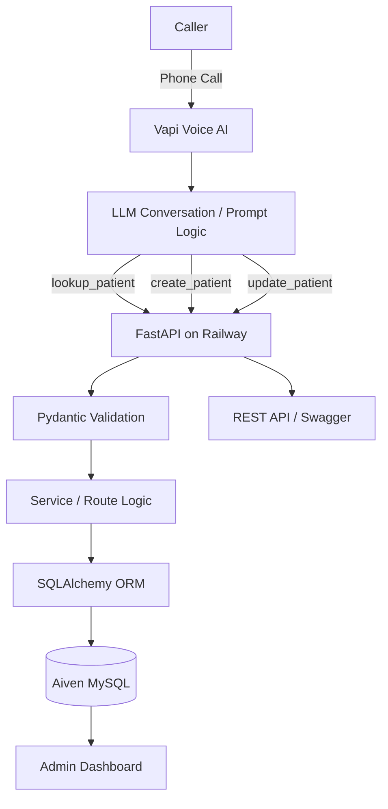
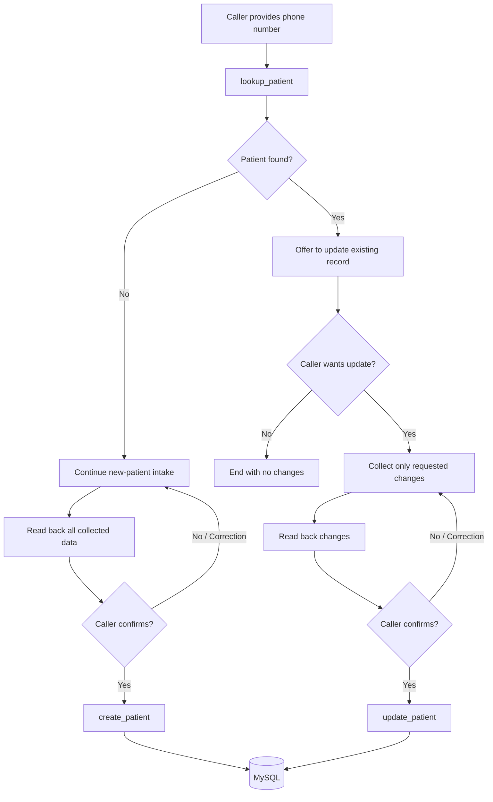

# Voice AI Patient Registration System

A deployed voice-based patient registration system that allows a caller to register through a natural phone conversation, validates and confirms demographic information, persists the record to MySQL, exposes the data through a REST API, and provides a lightweight administrative dashboard.

This project was built for the **Voice AI / Conversational AI Engineer take-home technical assessment**.

> **Demo / assessment use only. Do not enter real patient or protected health information.**

---

## Live Demo

| Resource | Value |
|---|---|
| **Phone Number** | **+1 (930) 239-9063** |
| **API Base URL** | `` |
| **Swagger / API Docs** | `https://YOUR-RAILWAY-DOMAIN/docs` |
| **Admin Dashboard** | `https://YOUR-RAILWAY-DOMAIN/dashboard` |
| **Health Check** | `https://YOUR-RAILWAY-DOMAIN/health` |
| **Repository** | `https://github.com/YOUR_USERNAME/voice-agent-patient-registration` |

### Reviewer Quick Test

1. Call **+1 (930) 239-9063**.
2. Register a **synthetic/test patient** through the voice agent.
3. Confirm the information when the agent reads it back.
4. Open the dashboard and verify the patient appears.
5. Query the patient through `GET /patients?phone_number=<10-digit-number>`.
6. Call again and provide the same phone number.
7. The agent should recognize the existing patient and offer to update the record instead of creating a duplicate.
8. Update one field, confirm the change, then refresh the dashboard/API to verify persistence.

No application credentials are required for the current demo endpoints.

---

## Overview

The system provides an end-to-end patient registration workflow:

- A caller reaches a real U.S. phone number.
- **Vapi** handles telephony and the conversational voice-agent experience.
- The agent conversationally collects required patient demographic information.
- Inputs can be provided naturally, out of order, or corrected during the call.
- The agent validates important fields and explicitly confirms the full registration before saving.
- Vapi invokes backend tools hosted by **FastAPI on Railway**.
- **Pydantic** performs server-side validation.
- **SQLAlchemy** persists data to **MySQL hosted on Aiven**.
- Returning patients are detected using their phone number and can update an existing record.
- A web dashboard provides a human-readable view of registered patients.

---

## Architecture



### Separation of Concerns

| Layer | Responsibility |
|---|---|
| **Vapi** | Telephony, speech interaction, conversational orchestration, tool calling |
| **Voice Prompt** | Intake flow, correction handling, confirmation rules, duplicate/update behavior |
| **FastAPI** | REST endpoints, business rules, request/response handling |
| **Pydantic** | Server-side input validation and normalization |
| **SQLAlchemy** | Data access and persistence abstraction |
| **Aiven MySQL** | Durable patient storage |
| **Jinja2 + Chart.js** | Lightweight administrative dashboard |
| **Railway** | Public backend deployment |

The voice layer never directly manipulates the database. It communicates with the backend through defined HTTP tools, keeping telephony/LLM behavior separate from API and persistence concerns.

---

## Core Features

### Voice Registration

The voice agent:

- speaks naturally rather than using an IVR-style questionnaire;
- asks only one or two questions at a time;
- remembers multiple fields provided in one response;
- accepts information out of order;
- handles corrections by using the newest value;
- re-prompts only for an unclear or invalid field;
- supports restarting the current registration;
- offers optional information only after required information is collected;
- reads the collected information back before any database write;
- requires explicit caller confirmation before saving.

### Required Patient Information

- First name
- Last name
- Date of birth
- Sex
- U.S. phone number
- Address line 1
- City
- State
- ZIP code

### Optional Patient Information

- Email
- Address line 2
- Insurance provider
- Insurance member ID
- Preferred language
- Emergency contact name
- Emergency contact phone

### Validation

Validation is performed both conversationally and on the backend.

Examples:

- names allow alphabetic characters, apostrophes, and hyphens;
- date of birth cannot be in the future;
- phone numbers are normalized to 10 U.S. digits;
- state names/abbreviations are normalized to valid two-letter U.S. state codes;
- ZIP code accepts `12345` or `12345-6789`;
- sex is normalized to one of:
  - `Male`
  - `Female`
  - `Other`
  - `Decline to Answer`
- email is validated when provided;
- empty optional values received from the voice tool are normalized safely instead of failing validation.

---

## New vs Returning Patient Flow



Duplicate protection also exists on the backend so a duplicate active phone number cannot accidentally create a second active record.

---

## Technology Stack

| Component | Technology | Why |
|---|---|---|
| Voice / Telephony | **Vapi** | Provides phone provisioning and voice-agent orchestration without rebuilding STT/TTS infrastructure |
| Backend | **FastAPI** | Lightweight, typed, fast to develop, excellent automatic OpenAPI/Swagger documentation |
| Validation | **Pydantic** | Strong server-side validation and normalization |
| ORM | **SQLAlchemy** | Clean separation between API/business logic and database access |
| Database | **MySQL / Aiven** | Persistent managed relational database suitable for structured patient demographics |
| Hosting | **Railway** | Simple GitHub-based FastAPI deployment with public HTTPS endpoint |
| Dashboard | **Jinja2 + Chart.js + CSS** | Provides a polished dashboard without adding a separate frontend deployment |
| Package Management | **uv** | Fast and reproducible Python dependency management |

---

## Project Structure

```text
voice-agent-patient-registration/
│
├── app/
│   ├── __init__.py
│   ├── main.py
│   ├── database.py
│   ├── models.py
│   ├── schemas.py
│   ├── exceptions.py
│   │
│   ├── routes/
│   │   ├── __init__.py
│   │   ├── patients.py
│   │   └── dashboard.py
│   │
│   ├── templates/
│   │   ├── dashboard.html
│   │   └── patient_detail.html
│   │
│   └── static/
│       └── dashboard.css
│
├── docs/
│   └── vapi_system_prompt.md
│
├── .env.example
├── .gitignore
├── pyproject.toml
├── uv.lock
├── requirements.txt
└── README.md
```

> If `docs/vapi_system_prompt.md` does not yet exist, create it before submission and paste the exact Vapi system prompt used by the deployed assistant into that file.

---

## Database Model

The `patients` table stores:

| Field | Type / Behavior | Required |
|---|---|---:|
| `patient_id` | UUID string, generated automatically | Auto |
| `first_name` | Up to 50 characters | Yes |
| `last_name` | Up to 50 characters | Yes |
| `date_of_birth` | Date, cannot be in the future | Yes |
| `sex` | Controlled value | Yes |
| `phone_number` | Normalized 10-digit U.S. number | Yes |
| `email` | Valid email | No |
| `address_line_1` | Street address | Yes |
| `address_line_2` | Apartment / suite / unit | No |
| `city` | Up to 100 characters | Yes |
| `state` | Two-letter U.S. abbreviation | Yes |
| `zip_code` | ZIP or ZIP+4 | Yes |
| `insurance_provider` | Insurance company | No |
| `insurance_member_id` | Member/subscriber identifier | No |
| `preferred_language` | Defaults to English | No |
| `emergency_contact_name` | Full name | No |
| `emergency_contact_phone` | Normalized U.S. number | No |
| `created_at` | Creation timestamp | Auto |
| `updated_at` | Last modification timestamp | Auto |
| `deleted_at` | Soft-delete timestamp | Auto / Nullable |

Deleted patients remain in the database but are excluded from normal active-patient queries.

---

## REST API

The API uses a consistent response envelope:

### Success

```json
{
  "data": {},
  "error": null
}
```

### Error

```json
{
  "data": null,
  "error": {
    "message": "Description of the error"
  }
}
```

### Required REST Endpoints

| Method | Endpoint | Description |
|---|---|---|
| `GET` | `/patients` | List active patients |
| `GET` | `/patients/{patient_id}` | Retrieve one patient |
| `POST` | `/patients` | Create a patient |
| `PUT` | `/patients/{patient_id}` | Partially update a patient |
| `DELETE` | `/patients/{patient_id}` | Soft-delete a patient |

`GET /patients` supports:

```text
?last_name=
?date_of_birth=
?phone_number=
```

### Voice-Agent Helper Endpoints

| Method | Endpoint | Purpose |
|---|---|---|
| `POST` | `/patients/lookup` | Look up an active patient by phone number |
| `POST` | `/patients/update` | Fixed-URL helper used by Vapi for partial updates |

The standard `PUT /patients/{patient_id}` endpoint remains available. `/patients/update` exists only to simplify voice-tool integration while preserving the required REST interface.

### Utility / UI Endpoints

| Method | Endpoint | Description |
|---|---|---|
| `GET` | `/` | API status message |
| `GET` | `/health` | Backend/database health check |
| `GET` | `/docs` | Swagger UI |
| `GET` | `/dashboard` | Patient administration dashboard |
| `GET` | `/dashboard/patients/{patient_id}` | Patient detail page |

---

## Example API Usage

### Create a Patient

```http
POST /patients
Content-Type: application/json
```

```json
{
  "first_name": "Jane",
  "last_name": "Doe",
  "date_of_birth": "1993-04-16",
  "sex": "Female",
  "phone_number": "2025550175",
  "address_line_1": "100 Main Street",
  "city": "Washington",
  "state": "DC",
  "zip_code": "20001",
  "preferred_language": "English"
}
```

### Find by Phone Number

```http
GET /patients?phone_number=2025550175
```

### Voice Duplicate Lookup

```http
POST /patients/lookup
Content-Type: application/json
```

```json
{
  "phone_number": "2025550175"
}
```

### Partial Update

```http
PUT /patients/{patient_id}
Content-Type: application/json
```

```json
{
  "address_line_1": "200 Updated Avenue",
  "city": "New York",
  "state": "NY",
  "zip_code": "10021"
}
```

---

## Vapi Configuration

The deployed assistant uses three backend tools.

### 1. `create_patient`

```text
Method: POST
URL: https://YOUR-RAILWAY-DOMAIN/patients
```

Called only after:

1. all required fields are collected;
2. the agent reads the information back;
3. the caller explicitly confirms that it is correct.

### 2. `lookup_patient`

```text
Method: POST
URL: https://YOUR-RAILWAY-DOMAIN/patients/lookup
```

Request:

```json
{
  "phone_number": "2025550175"
}
```

Called as soon as the agent has a valid phone number.

### 3. `update_patient`

```text
Method: POST
URL: https://YOUR-RAILWAY-DOMAIN/patients/update
```

The request contains:

- the `patient_id` returned by `lookup_patient`;
- only the fields the caller explicitly requested to change.

### Phone Routing

The Vapi phone number is assigned to the deployed **Patient Registration Agent** as its inbound assistant.

### Prompt Engineering

The assistant prompt explicitly defines:

- conversational behavior;
- required vs optional fields;
- validation expectations;
- correction handling;
- out-of-order information;
- restart behavior;
- duplicate lookup;
- new vs returning patient branching;
- final read-back and confirmation;
- strict rules preventing writes before confirmation;
- success/failure behavior;
- prevention of technical error details being spoken to callers.

The exact deployed prompt should be stored in:

```text
docs/vapi_system_prompt.md
```

This keeps prompt engineering versioned and reviewable alongside the application code.

---

## Admin Dashboard

The dashboard is available at:

```text
https://YOUR-RAILWAY-DOMAIN/dashboard
```

It provides:

- total active patient count;
- registrations today;
- registrations during the last seven days;
- recently updated patient count;
- patient distribution by state;
- recorded-sex distribution;
- recent registrations;
- patient search by name, phone, or email;
- filtering by state and sex;
- patient detail pages.

The dashboard intentionally remains read-only. Patient writes continue to flow through the validated API layer.

---

# Local Development Setup

## Prerequisites

Recommended development environment:

- Python 3.13
- `uv`
- MySQL, or access to an Aiven MySQL service
- Git

Install `uv` if required using the official installation instructions for your platform.

---

## 1. Clone the Repository

```bash
git clone https://github.com/YOUR_USERNAME/voice-agent-patient-registration.git
cd voice-agent-patient-registration
```

---

## 2. Install Dependencies

Using `uv`:

```bash
uv sync
```

If using the `requirements.txt` workflow instead:

```bash
pip install -r requirements.txt
```

Important dependencies include:

- FastAPI
- Uvicorn
- SQLAlchemy
- PyMySQL
- Pydantic
- email-validator
- python-dotenv
- cryptography
- Jinja2

---

## 3. Configure Environment Variables

Create a local `.env` file.

```env
DB_HOST=localhost
DB_PORT=3306
DB_NAME=voice_agent
DB_USER=root
DB_PASSWORD=your_password
```

For Aiven:

```env
DB_HOST=your-aiven-host.aivencloud.com
DB_PORT=YOUR_AIVEN_PORT
DB_NAME=defaultdb
DB_USER=avnadmin
DB_PASSWORD=YOUR_AIVEN_PASSWORD
```

Never commit `.env`.

A safe `.gitignore` should include:

```gitignore
.env
.venv/
__pycache__/
*.pyc
.pytest_cache/
```

---

## 4. Local MySQL Setup (Optional)

If using local MySQL instead of Aiven:

```sql
CREATE DATABASE voice_agent;
```

Then point the `.env` variables to that database.

The application currently creates missing SQLAlchemy tables during startup using metadata creation, so a separate migration command is not required for this assessment.

For a production system, schema changes should be managed with a migration tool such as Alembic.

---

## 5. Start the API

```bash
uv run uvicorn app.main:app --reload
```

The local API will be available at:

```text
http://127.0.0.1:8000
```

Useful URLs:

```text
http://127.0.0.1:8000/health
http://127.0.0.1:8000/docs
http://127.0.0.1:8000/dashboard
```

---

## 6. Verify Database Connectivity

Open:

```text
GET /health
```

Expected response:

```json
{
  "data": {
    "status": "healthy",
    "database": "connected"
  },
  "error": null
}
```

Then create a synthetic patient from Swagger and verify it using:

```http
GET /patients?phone_number=<number>
```

---

# Cloud Deployment

## Database — Aiven MySQL

1. Create an Aiven MySQL service.
2. Copy the host, port, database, username, and password.
3. Configure the backend environment variables with those values.
4. Use `defaultdb` when using the default Aiven database.
5. Verify the connection through `/health`.
6. Use only synthetic patient data.

---

## Backend — Railway

1. Push the repository to GitHub.
2. Create a Railway project.
3. Deploy from the GitHub repository.
4. Add the database environment variables:

```text
DB_HOST
DB_PORT
DB_NAME
DB_USER
DB_PASSWORD
```

5. Configure the Railway start command:

```bash
uv run uvicorn app.main:app --host 0.0.0.0 --port $PORT
```

6. Generate a Railway public domain.
7. Test:

```text
https://YOUR-RAILWAY-DOMAIN/health
https://YOUR-RAILWAY-DOMAIN/docs
https://YOUR-RAILWAY-DOMAIN/dashboard
```

8. Replace local/ngrok URLs in the Vapi tools with the Railway domain.

---

# Persistence Verification

To prove that patient data is genuinely persistent:

1. Create a synthetic patient.
2. Retrieve it through the API.
3. Restart the FastAPI process/deployment.
4. Query the same patient again.

Because records are stored in MySQL rather than application memory, the record remains available after backend restarts.

---

# Error Handling and Resilience

The backend returns appropriate errors rather than silently failing.

Implemented behaviors include:

- invalid request validation returns `422`;
- missing patients return `404`;
- duplicate active phone numbers return `409`;
- database failures roll back the transaction and return a controlled `500` response;
- soft-deleted records are excluded from normal queries;
- optional blank strings from voice-tool calls are normalized safely;
- callers are never told that a database write succeeded unless the tool confirms success;
- callers can correct information before confirmation;
- callers can restart an in-progress registration.

---

# Observability

The application logs successful patient creation payloads and backend/database errors to application stdout.

On Railway, these logs can be reviewed through the deployment logs.

For a production system, structured logging, trace IDs, centralized log storage, and PHI-aware redaction would be added.

---

# Bonus Features Implemented

### Duplicate Detection

Existing patients are detected by phone number before new registration is completed.

### Existing Patient Updates

Returning patients can update selected fields without repeating the entire intake process.

### Admin Dashboard

A live dashboard displays patient records and summary analytics directly from the persistent database.

---

# Security and Privacy

This application is an assessment/demo implementation and is **not a HIPAA-compliant production healthcare system**.

Current safeguards:

- secrets are stored in environment variables;
- `.env` is excluded from Git;
- API inputs are validated server-side;
- no API keys are hardcoded in source code;
- database operations use SQLAlchemy rather than manually constructed SQL;
- soft-delete preserves record history.

Important:

> **Do not use real patient information in this demo. Use synthetic/test data only.**

---

# Design Decisions and Trade-offs

### Vapi instead of custom STT/TTS

The challenge is primarily an integration and conversational-system problem. Using Vapi allowed effort to focus on conversation quality, tool orchestration, validation, persistence, and failure handling instead of reimplementing telephony infrastructure.

### FastAPI

FastAPI provides concise route definitions, automatic OpenAPI documentation, dependency injection, and tight integration with Pydantic validation.

### MySQL instead of an in-memory database

A managed MySQL database ensures patient records survive application restarts and deployment changes.

### Fixed helper endpoints for Vapi

The core API still provides standard REST endpoints. Additional `/patients/lookup` and `/patients/update` endpoints simplify voice-tool schemas and reduce the chance of malformed dynamic URLs during live calls.

### Server-rendered dashboard

Jinja2 was selected instead of creating a separate React application. This provides a strong reviewer-facing interface without introducing another frontend service, build system, CORS configuration, or deployment.

### Automatic table creation

`Base.metadata.create_all()` is adequate for the scope of the assessment and initial deployment. A real production application should use versioned migrations such as Alembic.

---

# Known Limitations

- This is not HIPAA compliant and must not contain real patient data.
- The demo API/dashboard currently does not include authentication or role-based access control.
- Persistent call transcripts/recordings are not stored.
- Appointment scheduling is not implemented.
- Multilingual switching is not implemented.
- Automated API tests are not currently included.
- Database schema migrations are not versioned with Alembic.
- The dashboard is read-only.
- Rate limiting and abuse protection are not implemented.
- Production-grade audit logging and PHI redaction are not implemented.
- Voice availability depends on the configured Vapi phone/telephony service.

These are intentional scope trade-offs for a time-constrained technical assessment.

---

# Next Steps

Given additional production-development time, the next improvements would be:

1. Add authentication and RBAC to the dashboard/API.
2. Add Alembic database migrations.
3. Add API integration and unit tests.
4. Store call summaries/transcripts linked to patient IDs.
5. Add structured logging and monitoring.
6. Add Spanish/multilingual support.
7. Add optional appointment scheduling.
8. Add rate limiting and request authentication for Vapi tool endpoints.
9. Add stronger audit trails and data-access controls.
10. Add production healthcare security/compliance controls if the system were ever adapted beyond a demo.

---

# Submission Notes

Before review, verify that:

- the repository is accessible to reviewers;
- the phone number is active and routed to the correct Vapi assistant;
- the Railway service is online;
- the Aiven database is running;
- `/health` reports a connected database;
- `/docs` is accessible;
- `/dashboard` is accessible;
- all Vapi tool URLs point to the Railway deployment;
- create, duplicate lookup, and update flows work end-to-end;
- only synthetic patient data exists in the database.

### Submission Information

Send the reviewer:

```text
Repository URL:
https://github.com/YOUR_USERNAME/voice-agent-patient-registration

Phone Number:
+1 (930) 239-9063

API Base URL:
https://YOUR-RAILWAY-DOMAIN

Testing Notes:
No credentials required for the current demo.
Please use synthetic patient data only.
Swagger: https://YOUR-RAILWAY-DOMAIN/docs
Dashboard: https://YOUR-RAILWAY-DOMAIN/dashboard
```

---

## License / Usage

Created solely for a technical assessment and demonstration. Not intended for clinical or production healthcare use.
